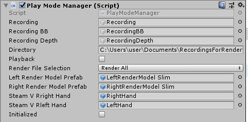

# VACE: Virtual Annotated Cooking Environment

The VACE simulator is an richly furnished interactive 3D VR kitchen environment which enables users to efficiently record well annotated object interaction samples. The VACE dataset is available at https://researchdata.tuwien.ac.at/records/r5d7q-bdn48. Visit our landing page at https://sites.google.com/view/vacedataset.

 <p float="center">
   
    
   
 </p>

Tested on Hardware:
* 16GB RAM
* AMD Ryzen 8 5900X 12-Core Processor
* GeForce RTX 3070

Tested on Software:
* Unity 2019.2.11f1
* SteamVR 1.22.13
* Windows 10
* HTC Vive (headset, 2 controllers, 2 base stations)
* HTC Vive tracker
* Occulus Quest 2

## Setup Instructions:
* Setup HTC Vive and tracker
  * https://www.vive.com/setup/vive/
  * https://www.vive.com/de/accessory/tracker3/
* Install SteamVR
  * https://store.steampowered.com/app/250820/SteamVR/
* Start SteamVR
  * Do room measurement and set up at least a 4m x 4m space
* Clone repo to your machine
* Install Unity Hub: 
  * https://unity3d.com/get-unity/download
  * Instruction: https://docs.unity3d.com/Manual/GettingStartedInstallingHub.html
* Open Unity Hub --> Installs --> Add --> Click "Visit our download archive" -->Redirect to: https://unity3d.com/get-unity/download/archive --> Scroll to Unity 2019.2.9 --> Click "Unity Hub" --> Back in Unity Hub, complete installing this version
* Now in Unity Hub --> Projects --> Open --> Open the downloaded project --> Choose Unity version 2019.2.9
* In Unity
  * Start the project
  * Window -> Package Manager and let it show all available packages --> Install Burst compiler
  * Install the SteamVR Unity plugin
    * https://valvesoftware.github.io/steamvr_unity_plugin/
    * Window --> SteamVR Input --> Verify that the actions "Record" and "ShowInstructions" are defined in the active action set, see below


  * File --> Open Scene --> Assets/Scenes/SampleScene.unity
  * In scene hierarchy, find the game object Manager, click it
  * In the inspector of the Manager, make sure the controller settings are correct, see below

  * More controller trouble shooting available at "Assets/SteamVR/SteamVR Unity Plugin - Input System"
    * http://localhost:27062/dashboard/controllerbinding.html?app=application.generated.unity.v4rvrkitchenv3.exe
  * In the same inspector window, set a path for the recordings, see below

  * In the hierarchy, find PlayerWithAvatar --> SteamVRObjects --> Tracker
    * In its inspector, make sure the device index of the tracker is 3
  * Make sure "Playback" is unchecked, click "Play" (the triangle) in the top

## Trouble Shooting Controller Problems
* If you want to rebind Buttons ot the hand modells are not showing up
* to change that either open the VR menu in the game or open the Menu in Steam VR by pressing the 
* three dashes in the steam VR window -> Press Settings -> go in the Controllers Tab -> Press Manage Controller Bindings ->
* in the drop down select the V4R-VR-Kitchen(only visible if simulator is running) -> select Custom under Active Controller Binding ->
* now select EDIT THIS BINDING -> here you can change the Bindings
  * if you dont see the Hands likely the Action Pose is not set up -> in the middle under the controller drawing click "Edit Action Poses"-> 
  * here add pose to "Left Hand Raw" and "Right Hand Raw"
  

## How to Interact
* Use the trigger or the grip button in both hands for grasping
* Grasp and hold non-furniture objects to pick them up
* Push objects without grasping them
* Grasp and hold the handles of drawers, the stove, the fridge, doors to open them
* Touch the stove buttons and the water faucet handle to turn them on/off
* Use knives and the grater to cut any food item into smaller pieces

## How to HUD
* Click center on the trackpad of the right controller to toggle the MPII 2 Cooking dataset recipe collection
* Click up and down on the right controller trackpad to select a recipe
* Click right on the trackpad to show the next step of the recipe, left to show the previous step of the recipe


## How to Record Samples
* When ready, click the menu button on the right controller, and then again to stop the recording

## How to play if you have a Steam VR Tracker
* in the Vace Scene under Manager you can click the "Use Steam VR Tracker" check box and the Tracker will be useable

## How to render in First Person
* in the Vace Scene under Manager click the "First Person Perspective" check box and the data will be rendered in first person

## How to render Annotation data that was created in the old Vace simulator
* in the Vace Scene under Manager click the "Old Annotation Data" check box 
* note that in First Person perspective this will lead to wrong boundig boxes if looking in areas without a ingame wall i.e. toword the screens or towords the sky

## How to Postprocess
* Stop the play mode after recording one or more samples, then put a check on "Playback" in the inspector of the Manager game object, and press play again. Post-processing is slower than real time.
* Add information about sample number, high level description, etc. to the readme file of the sample. That is the only annotation you need to perform manually. 

## Labeling Process and Sample Description
Please consult readme-resources/sample-description.txt to get an overview of the structure of a generated sample after postprocessing. Ground truth comes for free, and the post-processing stage allows for computationally expensive annotation like the logical predicates (on, in, etc.) and rendering multiple images per frame. The segmentation mask is the result of a shader that computes unique colors from object IDs. The depth mask uses a depth shader.
Automatic annotation is the main reason for the project and users do not have to manually label anything except provide a sample name and the high level steps they performed (i.e., which variation of a recipe they created).

## Citation
If you use this repository in your publications, please cite

```
@inproceedings{koller2022vace,
author = Koller, Michael and Patten, Timothy and Vincze, Markus},
title = {A New VR Kitchen Environment for Recording Well Annotated Object Interaction Tasks}},
booktitle= {Proceedings of the 2022 ACM/IEEE International Conference on Human-Robot Interaction},
pages = {x-y},
year = {2022},
}
```